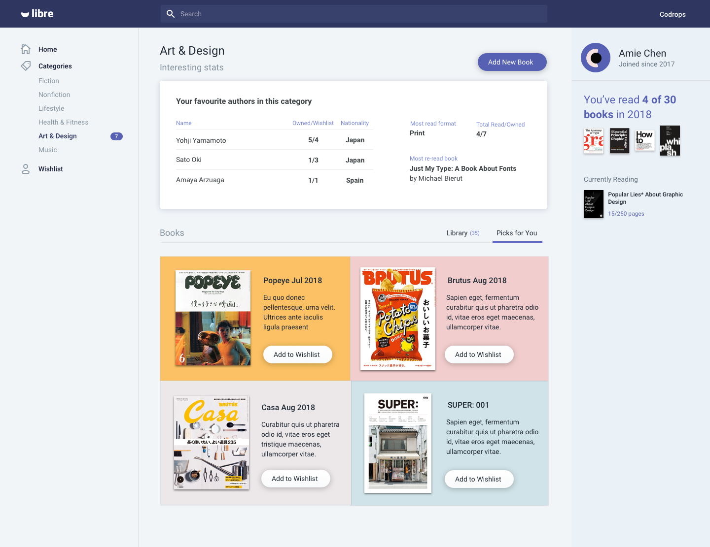

# Libre - a reponsive single page app template for collection management projects.



Libre is a responsive single page app template designed for developers who want to create collection management-like projects (e.g. books, music, podcasts, games, etc.). Built with tailwind.css and vanilla javascript, this template is easily customizable and has common components like profile, lists, filters and popovers which sets the ground work for your projects. Libre is made for Codrops exclusively.

## Running the project locally
Make sure your local version is v6+. I currently am using v10.8 as of Aug 2018.
```
npm install
```

If you want to regenerate css with your changes, run this command to generate css using tailwind config (e.g. tailwind.js)
```
$ ./node_modules/.bin/tailwind build style.css -c ./tailwind.js -o ./output.css
```

If you want to recompile the javascript, make sure browserify is installed globally then run this command to create bundle.js
```
$ npm install -g browserify
$ browserify main.js -o bundle.js
```

Check out the details on [Codrops]()

## Live Demo
👋 [Libre Live Demo]()

## Credits
- [Browserify](http://browserify.org/)
- [Anime.js](http://animejs.com/)
- [tippy.js](https://atomiks.github.io/tippyjs/)
- [Tailwind.css](https://tailwindcss.com/)
- [Shopify Polaris's Icons](https://polaris.shopify.com/)

## License
Use it freely but please do not republish, distribute or sell "as-is". [Read more about our license.](http://tympanus.net/codrops/licensing/)

## Misc

Follow Amie: [Website](https://www.amie-chen.com/), [Dribbble](http://www.dribbble.com/hyperyolo), [Github](https://github.com/amiechen), [Twitter](https://twitter.com/hyper_yolo), [Medium](https://medium.com/@hyperyolo)

Follow Codrops: [Twitter](http://www.twitter.com/codrops), [Facebook](http://www.facebook.com/pages/Codrops/159107397912), [Google+](https://plus.google.com/101095823814290637419), [GitHub](https://github.com/codrops), [Pinterest](http://www.pinterest.com/codrops/)

[© Codrops 2018](http://www.codrops.com)